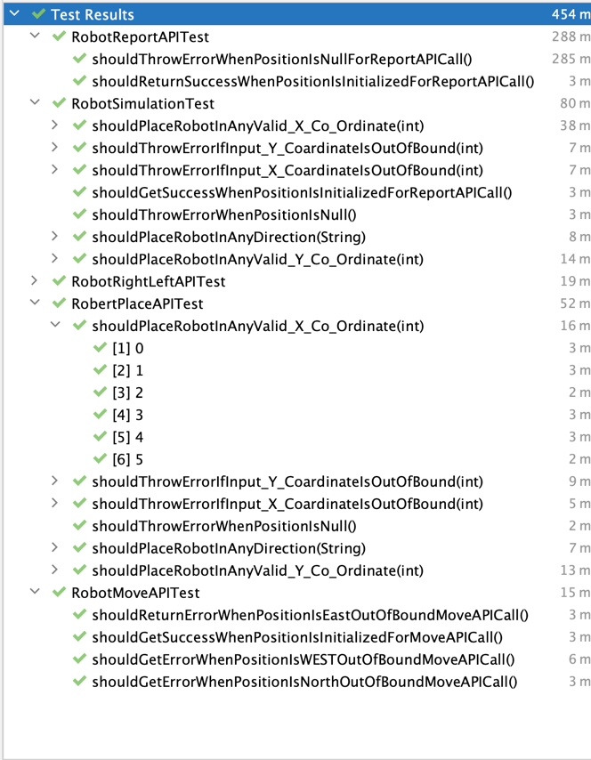
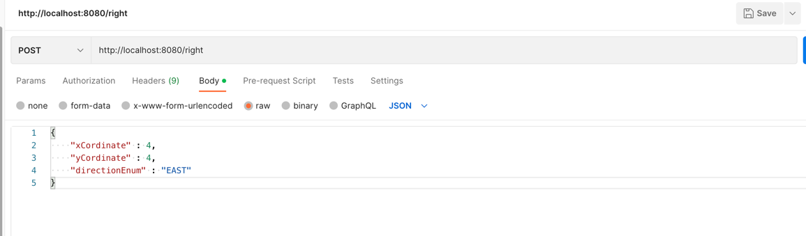

#      *** Toy Robot Simulator ****

##  Description
The application is a simulation of a toy robot moving on a square tabletop, of dimensions 5 units x 5 units.

#### Author : RASHMI VISHNU

## Scenarios covered
1)Application can take inputs through the rest end points exposed.
Following are the rest end points exposed to simulate the robot's motion.
 PLACE  
 MOVE
 LEFT
 RIGHT
 REPORT

2) Basic validations around the input

## Pre-requsites
* gradle
* Java 11

# Running the Simulation

## To run from Eclipse/IntelliJ
Run as application in intelliJ "RobotApplication.java"

### To build the application

./gradlew clean build

### To run the application from command prompt or using gradle

./gradlew bootRun

## Swagger 
1. Start the application using bootRun

2. Browser : http://localhost:8080/swagger-ui.html

## Assumptions 
1. Default port will be tomcat's default port -8080
2. Only basic few validations are provided.
3. Covers few basic test scenarios including success and error cases
 
## Scope for Enhancements
1. Extensive test cases to cover more scenarios can be added
2. Validations can be enhanced to include more on the inputs. Basic validations are provided for now.
3. User Interface can be provided.
4. Various levels of testing can be included

## Technical Notes
Below are some details on technical aspects of the project and few learnings.
### Development approach

### Testing
Unit tests
Can be improved to include component,blackbox etc.

#### Screenshot of Test Execution

#### Sample postman

#### Sample Curl commands
1. **PLACE**

    curl --location --request POST 'http://localhost:8080/post' \
   --header 'Content-Type: application/json' \
   --data-raw '{
   "xCordinate" : 4,
   "yCordinate" : 4,
   "directionEnum" : "EAST"
   }'

2. **MOVE**

     curl --location --request POST 'http://localhost:8080/move